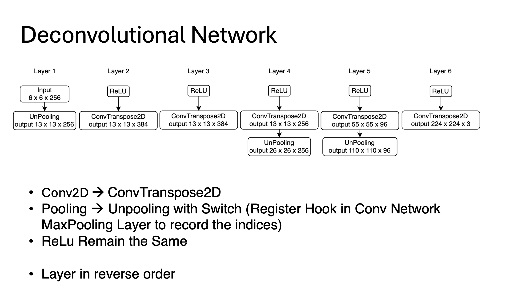
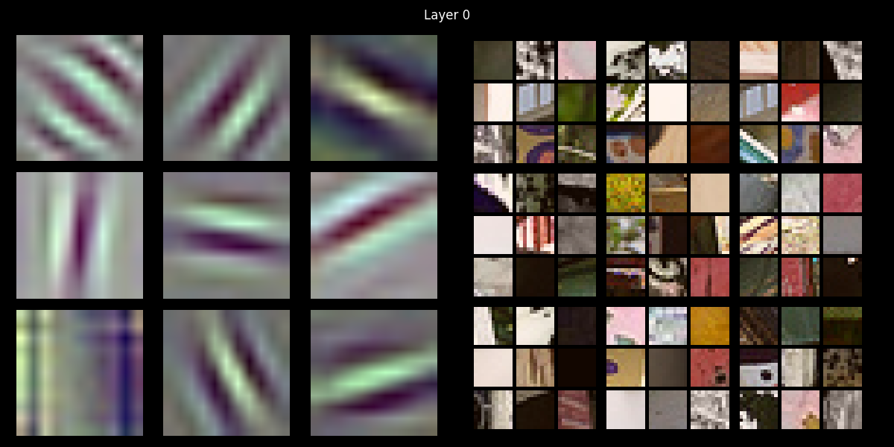
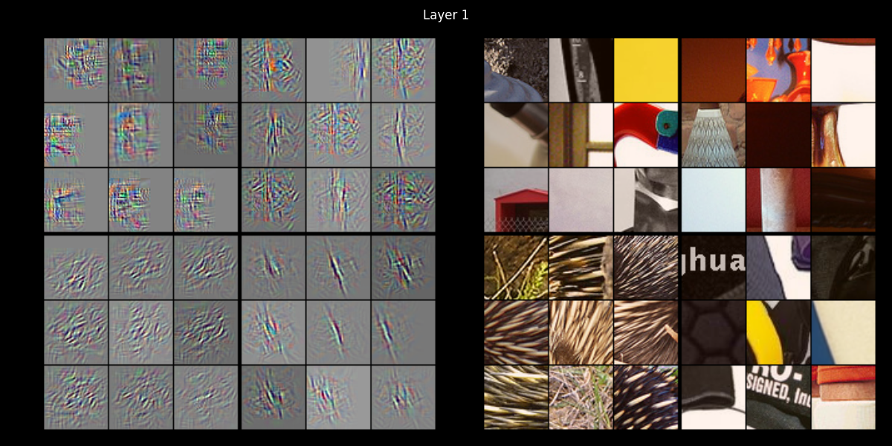
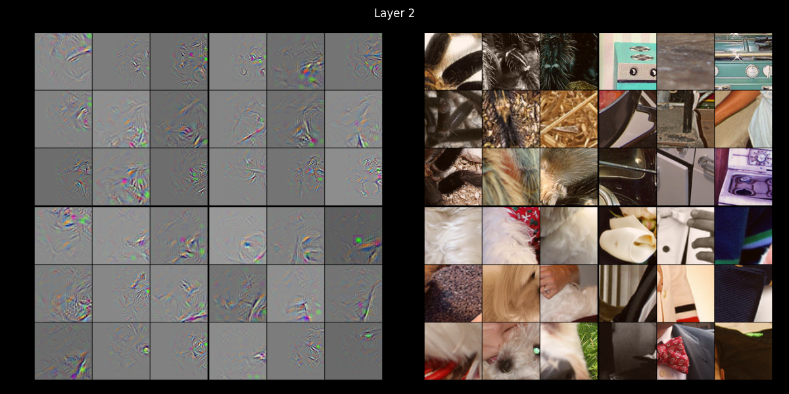
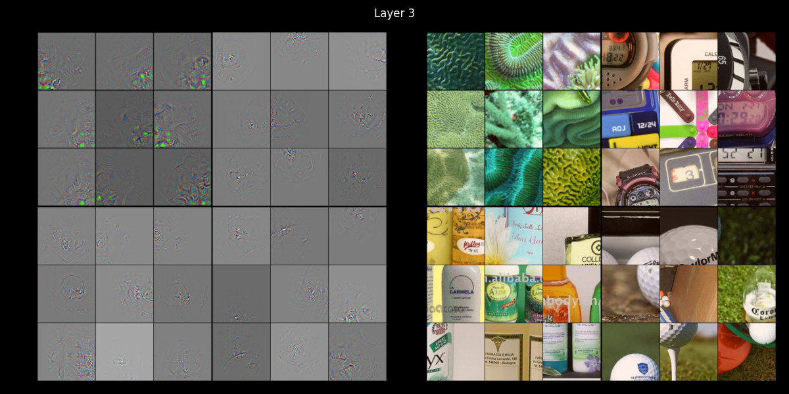
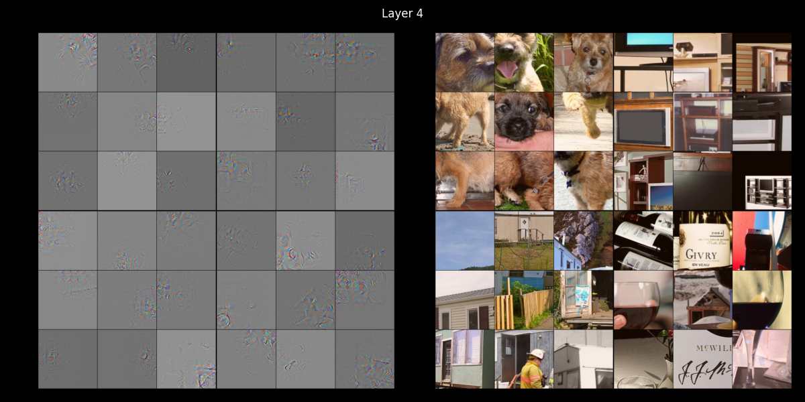
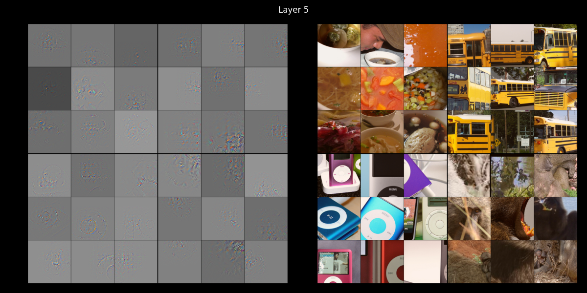

# Deconvolutional Network
Replicate Figure 2 in the paper [MD Zeiler. Visualizing and understanding convolutional networks. In European conference on computer vision/arXiv, volume 1311, 2014.](https://arxiv.org/abs/1311.2901)

# ConvNet
ConvNet better using AlexNet, you can find custom AlexNet in `networks/customAlexNet.py`

I also implement a ConvNet with hooks in `networks/convNetwork.py` and you can train it by your self using `train.py`, but the result is not as good as pre-trained AlexNet. 

If you want to train the ConvNet by yourself, you can download the ImageNet2012 dataset and use the following command:
```bash
python train.py --dataset ./data --batch_size 128 --lr 0.00001 --momentum 0.9 --num_epochs 70 --num_workers 8
```

# DeConvNet


# What I got







# Note
I highly not recommend you to do not follow the paper to train the ConvNet, at least it does not work for me. Initialize the weights to 10^{-2} and biases to 0 and start with a learning rate of 10^{-2} is not a good idea, leads to gradient explosion and then gradient vanishing.

Author did mention they "show the top 9 activations" in the paper, but to do this, you need to zero out all other activations other than the single selected activation in one turn and do it 9 times. Otherwise, the image will be a mess.

Displaying the result is bit tricky, you can refer to `visualizeDeconv.py` to see how I do it. The program read the image in BGR format instead of RGB, so you need to carefully set the color channel in each step. Also I implement an augmentation to make the result look more sharp.